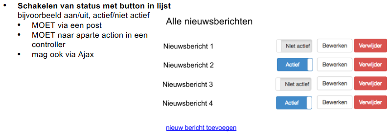

    Praktijkopdracht
        •Beveiliging
        •Inloggen: bepaalde functionaliteit is afgeschermd voor alleen ingelogde gebruikers, maakt niet uit welke gebruiker, als je maar                     bent ingelogd als rol ‘gebruiker’
        
        •Validatie: bij invoervelden wordt gebruik gemaakt van verplichte velden, en/of velden met controle op inhoud (denk aan een postcode of emailadres), gebruiker krijgt foutmeldingen te zien (deze zijn NIET te omzeilen door bijv. javascript uit te zetten...)
        
        
        •Verschillende rollen (dus meerdere soorten gebruikers), bijvoorbeeld
            
            •Admin rol
            
            •Gebruiker rol
        
        
        •Verschillende rechten
            
            •Admin gedeelte alleen toegankelijk voor ingelogde admin
            
            •Gebruiker heeft eigen afgeschermde deelwaarin hij zijn gegevens kan aanpassen. Een andere gebruik kan hier niet bij (door er bijvoorbeeld naar te dieplinken).
        
        
        •Zoeken & Filteren
            
            •Vrije tekst:zoekveld met vrije tekst, zoekt in meerdere kolommen (bijvoorbeeld in naam en ‘bericht’), hoeft niet in het hele systeem te zoeken, mag ook voor een specifieke lijst met data (bijv. nieuwsberichten).
            
            •filtermogelijkheid: dmv dropdownlist. Bijvoorbeeld alle nieuwsberichten van categorie 1 of 2 zien
            
            •combinatie van zoeken EN filteren, of filteren op meerdere categorieën levert een extra punt op
            
            
        •Beveiliging
            •OWASP top 10
            •OTAP
            •Weet wat komt kijken bij deployment naar een live/productie omgeving
            •Snap waar al je configuraties binnen jouw framework staan•kanuitleggen hoe en wat moet worden aangepast voor een ‘publish’ naar productie
            •(pre = Heb de O & P uit de OTAP verwerkt in je project)
           

